# 이준

iOS, Swift 를 공부하고 있는 대학생입니다.

#### 개인 정보
- [Github](https://github.com/leejun6694)
- leejun6694@gmail.com

#### 학력
- 제주제일고등학교
- 인하대학교 / 컴퓨터공학과 (**2019.08 졸업 예정**)

## 경력
[LINE](https://linepluscorp.com/) (internship)
- 2019.01 ~ 2019.02

[LINE](https://linepluscorp.com/)
- 2019.07 ~

## 활동
### iOS
- 커넥트재단 / [부스트캠프](http://boostcamp.connect.or.kr/) iOS 2th
  - 2017.07 ~ 2017.08 (수료)
  - iOS 학습 프로젝트 (5주) + 실무 프로젝트 (3주)
  - 개인 과제 [github](https://github.com/leejun6694/BoostCamp_iOS_kooma)
  - 팀 MOGAY [github](https://github.com/leejun6694/BoostCamp_mogay)
  - project/HomeBase/[github](https://github.com/leejun6694/HomeBase)
  - project/HomeBase/[AppStore](https://itunes.apple.com/kr/app/homebase-for-baseball-team/id1279185667?l=en&mt=8)
- 커넥트재단 / [부스트코스](https://www.edwith.org/boostcourse-ios) iOS 에이스
  - 2018.06 ~ 2018.09
  - iOS 학습 및 프로젝트
- 미래부 창의인재도전 팀
  - 2017.09 ~ 2017.12
  - 과학기술정보통신부 장관상
  - 인천국제공항공사 경진대회 금상

### LIKELION
- [멋쟁이사자처럼](https://likelion.net/) 5기 인하대 멘티   
  - 2017.03 ~ 2017.12 (수료)
  - Ruby & Ruby on Rails 학습
  - 멋쟁이사자처럼 Hackathon 참가
- [멋쟁이사자처럼](https://likelion.net/) 6기 인하대 멘토  
  - 2018.03 ~ 2018.12
  - [OOP & Git 교육](https://slides.com/leejun6694)

## 프로젝트
### HomeBase
사회인 야구팀을 위한 경기 스케줄 및 경기 결과 관리 앱!  
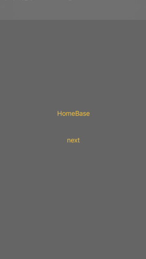 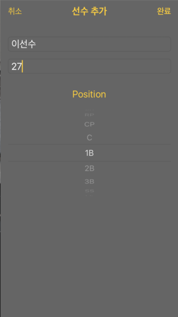 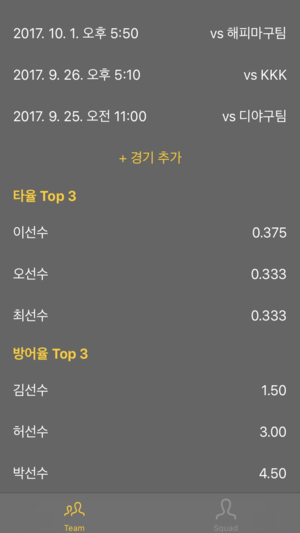 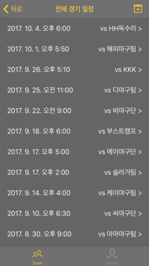 
- 2017.08.04 ~ 08.24 (BoostCamp project)
- [AppStore](https://apps.apple.com/kr/app/homebase-for-baseball-team/id1279185667)
- [Repository](https://github.com/leejun6694/HomeBase)
- `Swift 3`, `xCode8`
- `UIKit (TableView, PageView)`, `SQLite`, `Protocol`, `Localization`, `UserNotifications`

### HomeBase 2018
HomeBase 확장 버전. (+ 서버)  
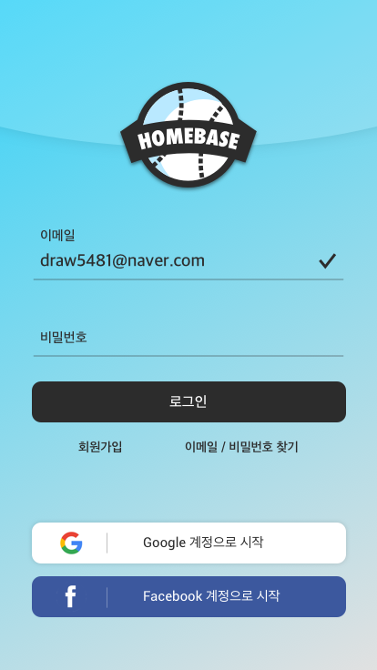 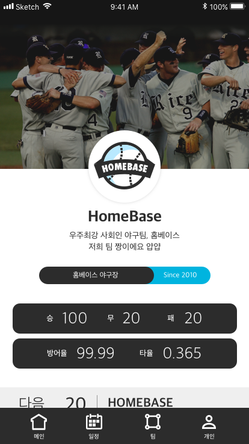 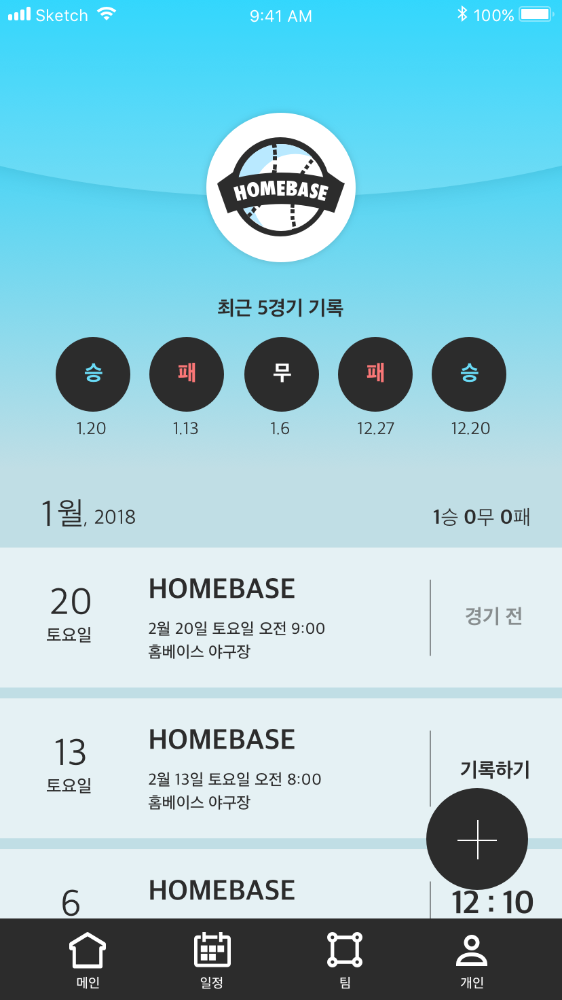 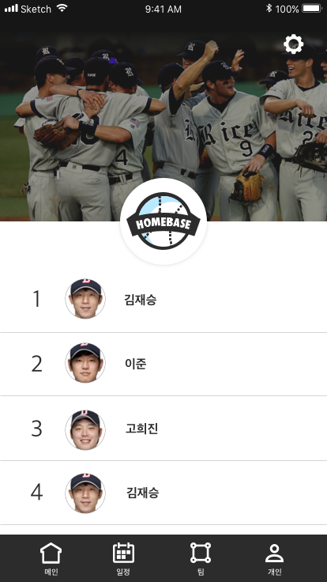 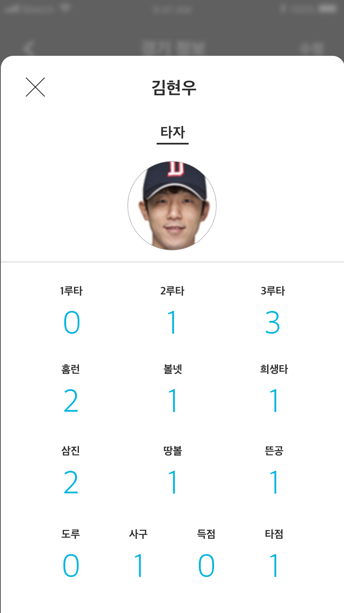
- 2018.01 ~ 2018.07 (일시 중단)
- [Repository](https://github.com/leejun6694/HomeBase_iOS)
- `Swift 4`, `xCode9`
- `Firebase (Auth, DB, Storage)`, `Alamofire`, `Auto Layout`, `UITableView`

### Moong
나도 말 잘하고 싶다  
'말이되는 글' 을 쓰고싶은 '아무말러' 에게 필요한 서비스!  
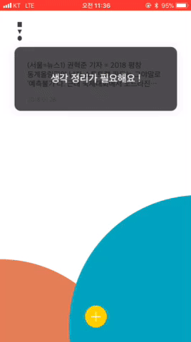
- 2018.01.26 ~ 01.28 (Unithon 6th 2박 3일)
- [Repository](https://github.com/leejun6694/MOONG_iOS)
- `Swift 4`, `xCode9`
- `UI/UX 구성`, `Auto Layout`

### Fore Message
옛날 감성 문자 서비스 :)  
고민하며, 공부하며  개발해보자! (라이브러리 x)  
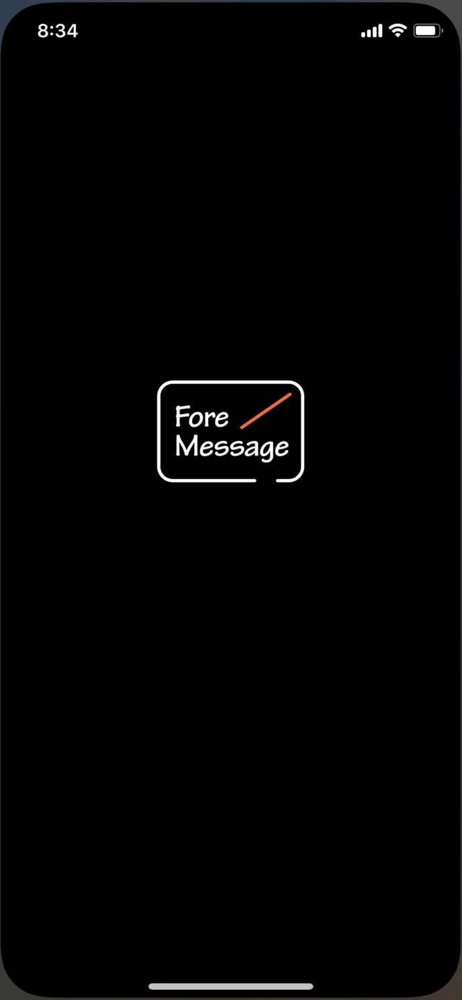
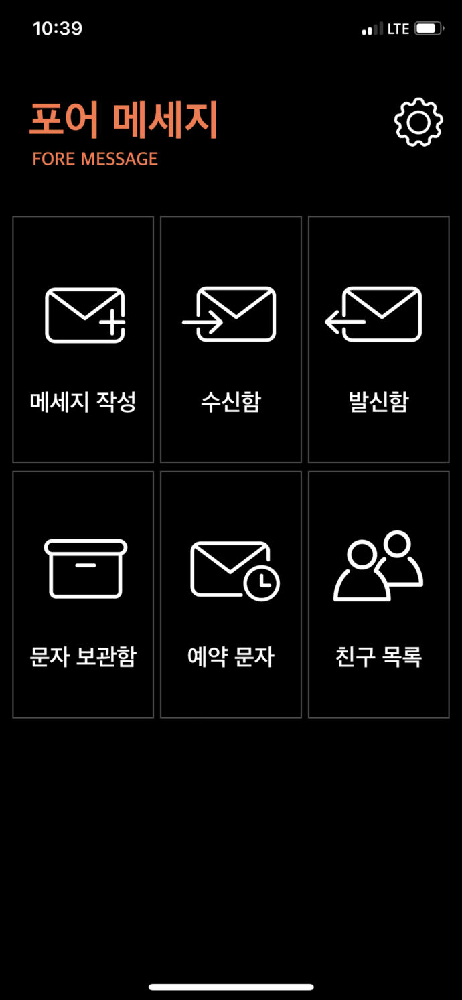
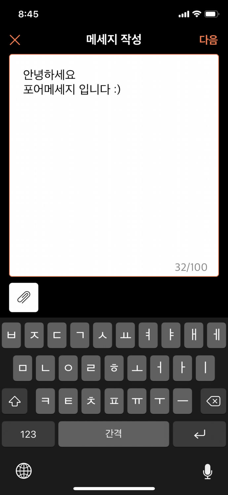
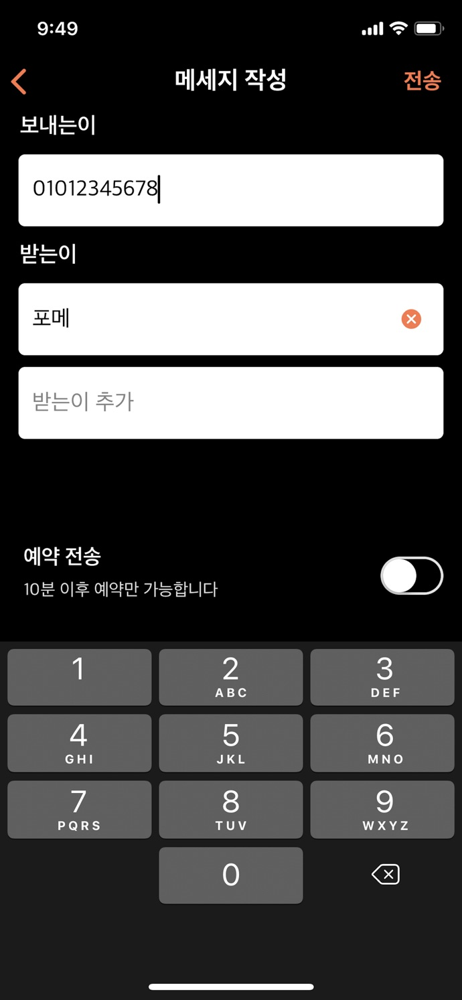

- 2018.07 ~ 2019.05
- [AppStore](https://apps.apple.com/kr/app/foremessage/id1463129451)
- Repository (private)
- `Swift 4`, `xCode10`
- `APNs`, `Notification Extension Service`
- `HTTP Request`
- `CoreData`, `DAO`
- `Custom Extensions`
- `UI/UX`, `Auto Layout`
