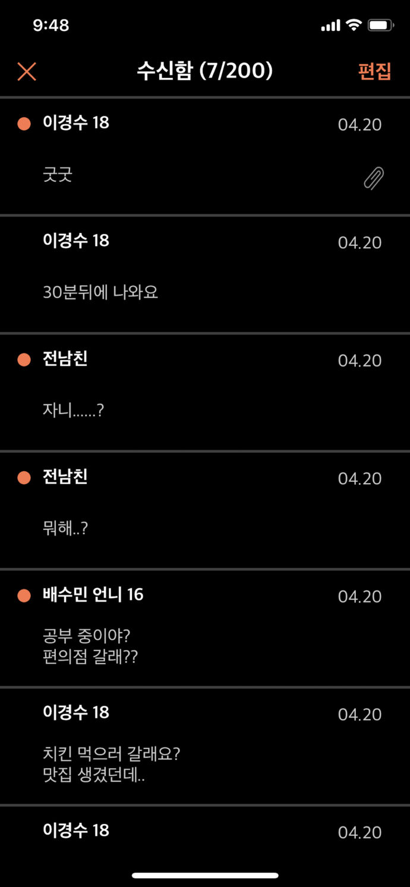

# 이준

iOS, Swift 를 공부하고 있습니다.  

#### 개인 정보
- [Github](https://github.com/leejun6694)
- leejun6694@gmail.com

#### 학력
- 제주제일고등학교
- 인하대학교 / 컴퓨터공학과  

## 경력
[NAVER](https://www.navercorp.com/)
- 2024.12 ~

[LINE](https://linepluscorp.com/)
- 2019.07 ~ 2024.11

[LINE](https://linepluscorp.com/) (internship)
- 2019.01 ~ 2019.02

## 활동
### iOS
- [야곰 아카데미](https://yagom.net) 리뷰어
  - 2021.07 ~ 2023.01
- [부스트 캠프](http://boostcamp.connect.or.kr/) iOS 2th
  - 2017.07 ~ 2017.08 (수료)
- [부스트 코스](https://www.edwith.org/boostcourse-ios) iOS 에이스
  - 2018.06 ~ 2018.09

### ETC
- [멋쟁이사자처럼](https://likelion.net/) 6기 인하대 멘토  
  - 2018.03 ~ 2018.12
- [멋쟁이사자처럼](https://likelion.net/) 5기 인하대 멘티   
  - 2017.03 ~ 2017.12 (수료)
- 미래부 창의인재도전 팀
  - 2017.09 ~ 2017.12
  - 과학기술정보통신부 장관상
  - 인천국제공항공사 경진대회 금상

## 프로젝트
### Fore Message
옛날 감성 문자 서비스 :)  
고민하며 개발해보자!  

- 2018.07 ~ 2019.05
- [AppStore](https://apps.apple.com/kr/app/foremessage/id1463129451)
- Repository (private)
- `Swift 4`, `xCode10`
- `APNs`, `Notification Extension Service`
- `HTTP Request`
- `CoreData`, `DAO`
- `Custom Extensions`
- `UI/UX`, `Auto Layout`

### HomeBase 2018
사회인 야구팀을 위한 경기 스케줄 및 경기 결과 관리 앱.  
    
- 2018.01 ~ 2018.07 (일시 중단)
- Repository (private)
- `Swift 4`, `xCode9`
- `Firebase (Auth, DB, Storage)`, `Alamofire`, `Auto Layout`, `UITableView`
